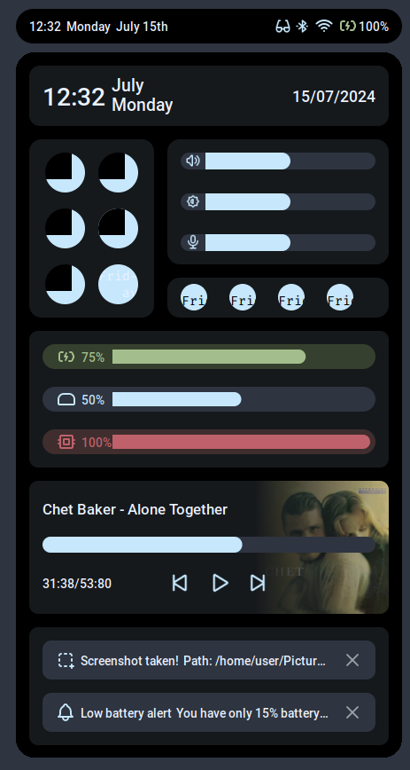

# Usage
Simply clone the repo inside your AwesomeWM configuration path, then use the project as a widget in your `rc.lua` like this:
```lua
desired_screen = 1
hover = require("hover")
panel_widget = hover {
   theme = "nord_m",
   screen = desired_screen
}
```
Now, you can use it as a widget in your AwesomeWM bar:
```lua
...
		my_bar:setup {
            ...
			panel_widget,
			...
		}
...
```
# Current state
